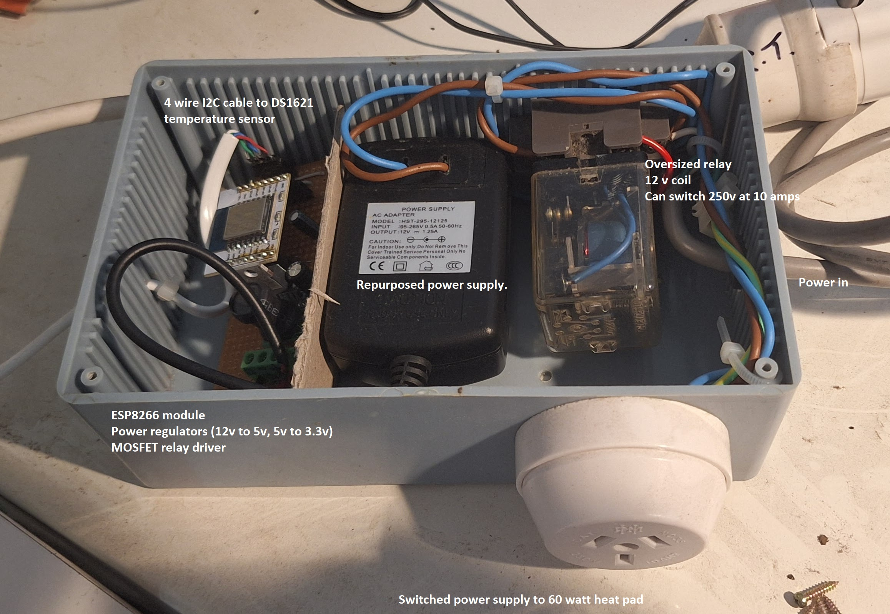

# ESP_8266 Beer Brew Temperature Controller

This is a personal project that I made to help me brew beer.   It could easily be used for any other simple temperature monitoring and control purposes. 
My beer ferments in an old fridge, which I use to keep the temperature consistent.  However, in winter, the brew can get too cold, and this device helps me keep an eye on the temperature, and allows me to control how cold it can get.

It uses An ESP8266 (AI-THINKER) module to monitor and chart temperature over time, accessible via a web interface.
The software controls a heater, switching it on when the temperature falls below a configurable set point, and turning the heater off when the temperature goes above another.

The temperature sensor is a DS1621 I2C chip (8 pin DIP), which measures temperature in 0.5°C steps.  This seems to be accurate enough, considering temperature differences that can happen within the enclosed environment. 

The temperatures are charted as half hourly averages, with the current, minimum and maximum values also displayed.  This is all visible via the web page, served by the device to browsers on the local WiFi. The NTP protocol is used to obtain current time, and to keep the clock in sync.

To deal with resets and reprogramming, the configuration and the last 24 hour chart values are stored in flash memory.  So nothing is lost by unplugging and moving equipment around.

**Update Feb-2025:**

A big code refactor, and the code now supports posting temperature readings to a web service (HTTPS POST).

The project had out-grown the Arduino approach of having everything in one file, so it is now split up into a handful of C++ classes.

To be able to monitor remotely, I've used AWS API Gateway, a Lambda function, and a DynamoDB table to store the temperature readings in the cloud.
This is optional to use, and is enabled by setting a CloudAPI URL and API Key in the configuration web page.  Once this is done, the ESP8266 will send HTTPS POST requests to the configured URL, containing a JSON payload in the body.
A root certificate can also be loaded to verify the server when connecting.  Insecure posting is available without the certificate, but this isn't ideal.

**Yet to do:**

- Split this README into multiple pages.
- The temperature being pushed to the web service is the current reading of a new interval, which isn't making use of the average readings from the previous interval. I'll fix this up soon, but wanted to get basic end-to-end communication going first.
- I'll add logging into a circular buffer, so the results of posting are easier to see and diagnose.
- AWS Lambda cold-starts for .Net are a bit of a problem, with AWS taking around 8 seconds to start up the Lambda and respond.  Either I sort out Native AoT or SnapStarts, or re-implement the lambda in a language that doesn't suffer from the cold-start issue.
- I'll host a page that pulls the current readings from AWS and charts them.   For now, I'm just viewing the raw JSON [here](https://lakptuva0h.execute-api.ap-southeast-2.amazonaws.com/Prod/).

## Notes for programming / hardware

### Programmer board.
- I used the "getting started" information [here](https://tttapa.github.io/ESP8266/Chap01%20-%20ESP8266.html) as a basis for initial programming.
- Programming the module using only power from the USB to TTL adapter may work initially,  But, the module needs more power (external supply) once it tries to connect to the WiFi.  So an external power source is eventually required.
- I've used a LD1117 3.3v regulator to supply power to the ESP8266, regulating down from a 5v source.  In my case, it was a repurposed old tablet USB power adapter.
- When connecting the USB/TTL to programmer board, a "cross over" connection is needed.  i.e. Rx to Tx, Tx to Rx.
- To boot into "programming mode", hold down the reset and programming push buttons, then release the reset button first.  After this, you can take your hand away, and the device will be ready to accept new code from the Arduino IDE.

The programmer board I used is based on the diagram [here](https://tttapa.github.io/ESP8266/Chap02%20-%20Hardware.html).  An optional improvement would be the auto-reset / auto-program circuitry described in the [subsequent chapters](https://tttapa.github.io/ESP8266/Chap06%20-%20Uploading.html).

Now that I'm using OTA updates for most changes, the programming board isn't getting much use.   But it is necessary for initial programming via the serial port (USB/TTL), and can be helpful for debugging.

### Running board
- To save parts, and time soldering, the "temperature controller" doesn't have the reset / programming buttons.  It just has the reset pullup resistor so the module will start on power up.
- The board exposes a four pin I2C header for plugging in the temp sensor (3.3v power, ground, clock and data pins).  Some isolation / current limiting resistors between the sensor and the ESP module would be a worthwhile improvement, as a short in the sensor's cable can impact the ESP module.  For now, I'm careful with my wiring, and willing to replace the cheap modules if I accidentally fry one.
- The relay I used is an old 12 volt coil, 250v 10 amp switching relay.  I liked the screw connectors on the cradle that it sits in and didn't want to think about a PCB to switch mains power.  The relay coil is driven via a IRF7401 MOSFET (but any suitable current n-channel MOSFET would do).  I used a 680 ohm resistor between GPIO 16 and the MOSFET's gate.   I also put a 10k resistor between the MOSFET's gate and ground.  This is to turn the MOSFET turn off if the GPIO pin is not driven.  
- Because the initial power supply is 12 volts to drive the relay, I've used two regulators in series for power.  This saves one regulator having watts to dissipate, and a heatsink needed. i.e. 12 - 3.3 = 8.7 volts.  Multiplied by 170 mA maximum current for the module, equates to approximately 1.5 watts.  The first regulator takes 12v to 5v.  Then the 5v is regulated down to 3.3v using an LD1117 3.3v.  Choosing a 5 volt relay would simplify this, and the whole setup could run from an old USB power adapter.
- The relay's coil is between the 12v supply and the drain of the mosfet.  The Mosfet's source is tied to ground.
- Another improvement, would be to add a second output to control "cooling", by turning on the old fridge itself.  But for now, most of my brewing is in colder temperatures and cooling isn't an issue.

## References
https://arduino-esp8266.readthedocs.io/en/latest/esp8266wifi/server-examples.html

https://tttapa.github.io/ESP8266/Chap10%20-%20Simple%20Web%20Server.html
